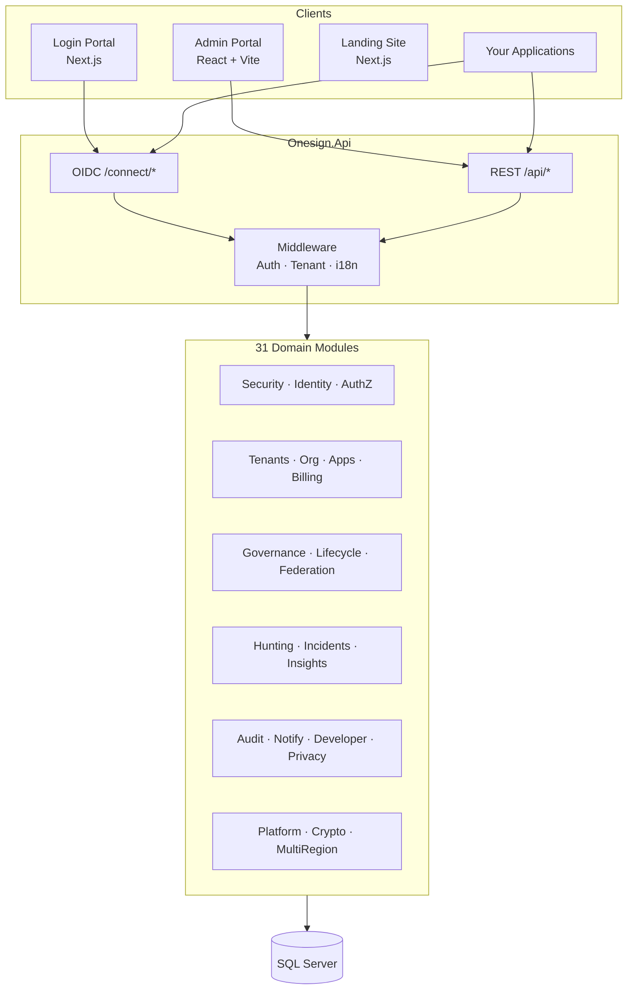

# OneSign

**Enterprise SSO, IAM & Identity Governance Platform**

<p align="center">
  <strong>وان‌ساین</strong> — پلتفرم یکپارچه احراز هویت سازمانی، SSO و مدیریت هویت و دسترسی (IAM)
</p>

<p align="center">
  
  
  
  
  
  
  
  
</p>

---

## Table of Contents

- [Overview](#overview)
- [Who It Is For](#who-it-is-for)
- [Capabilities](#capabilities)
- [Architecture](#architecture)
- [Repository Layout](#repository-layout)
- [Quick Start](#quick-start)
- [Configuration](#configuration)
- [API & Protocols](#api--protocols)
- [SDKs](#sdks)
- [Testing](#testing)
- [Development](#development)
- [Documentation](#documentation)
- [Troubleshooting](#troubleshooting)
- [Contributing & Support](#contributing--support)

---

## Overview

OneSign is a production-oriented **Identity & Access Management (IAM)** platform for multi-tenant SaaS and enterprise workloads. It centralizes authentication (SSO), authorization, tenant governance, security operations, and compliance in a single modular backend, with dedicated user-facing and admin experiences.

<details>
<summary><strong>نمای کلی (فارسی)</strong></summary>

وان‌ساین یک سامانه **IAM/SSO سازمانی** است که احراز هویت، مجوزدهی، چند‌مستأجری، حاکمیت هویت و عملیات امنیتی را در یک بک‌اند ماژولار (.NET 10) متمرکز می‌کند. فرانت‌اند شامل پورتال ورود (Next.js)، پورتال مدیریت (React/Vite) و لندینگ بازاریابی (Next.js) است. پروتکل‌های استاندارد OIDC/OAuth2، SAML و SCIM پشتیبانی می‌شوند و رابط کاربری از **انگلیسی** و **فارسی** پشتیبانی می‌کند.

</details>

| Layer | Stack |
|-------|--------|
| **API** | ASP.NET Core (.NET 10), MediatR, FluentValidation, EF Core 10 |
| **Data** | SQL Server |
| **Login UI** | Next.js 16, React 19, next-intl |
| **Admin UI** | React 18, Vite 5, TanStack Query, Tailwind |
| **Marketing** | Next.js (`onesign-landing`) |
| **Client SDKs** | .NET SDK, React SDK (`@onesign/react-sdk`) |

---

## Who It Is For

| Persona | What they get |
|---------|----------------|
| **Platform / Global Admin** | Tenant lifecycle, platform health, cross-tenant policies |
| **Tenant Admin** | Users, apps (OAuth clients), branding, security policies, audit |
| **End user** | SSO login, MFA, password reset, account center |
| **Developer / Integrator** | OIDC clients, API keys, webhooks, SDKs, developer portal |
| **Security / GRC** | Access reviews, PAM, incidents, hunting, privacy (GDPR-style flows) |

---

## Capabilities

### Authentication & session security

- OpenID Connect / OAuth 2.0 (**Authorization Code + PKCE**)
- MFA: TOTP, email OTP, SMS; adaptive / risk-based policies
- Social & enterprise IdP flows (Google, Microsoft, Apple, passkeys, magic link)
- Session lifecycle, password policies, first-login and reset flows

### Multi-tenancy & organization

- Hard tenant isolation, per-tenant branding and configuration
- OrgUnit hierarchy with delegated administration
- Application (OAuth/OIDC client) registry per tenant

### Authorization & governance

- RBAC and ABAC policy engine, privileged access (PAM), access-request workflows
- Identity lifecycle (joiner / mover / leaver), federation (SAML, OIDC)
- Governance, access reviews, audit trail, privacy & data-subject tooling

### Security operations & platform

- Threat hunting workspace, incident management, insights & reporting
- Automation playbooks, change management, observability (logs / metrics / trace hooks)
- Billing & plans, notification center, extensibility (webhooks), multi-region, deployment gates
- Developer portal, API documentation surface, optional Copilot assistance

> Full feature inventory: [`docs/OneSign-Features-Complete.md`](docs/OneSign-Features-Complete.md)

---

## Architecture

OneSign uses a **modular monolith**: Clean Architecture and DDD boundaries per module, composed into a single deployable API (`Onesign.Api`).



### Backend modules (31)

| Domain | Modules |
|--------|---------|
| **Security** | Identity, Security, Authorization, AccessRequests, AdaptiveSecurity, PrivilegedAccess |
| **Business** | Tenants, Organization, Applications, AccountCenter, Billing |
| **Governance** | Governance, IdentityInsights, IdentityLifecycle, Federation |
| **Integration** | Audit, Developer, Extensibility, NotificationCenter, Privacy, Copilot |
| **Operations** | Automation, ChangeManagement, Hunting, Incidents, Insights, Observability |
| **Platform** | Platform, Crypto, Deployment, MultiRegion |

**Shared projects:** `Onesign.Shared`, `Onesign.Data`, `Onesign.Sdk.DotNet`

**Solution file:** [`Onesign.sln`](Onesign.sln)

---

## Repository Layout

```
OneSign/
├── src/
│   ├── Onesign.Api/                 # HTTP API, OIDC, controllers
│   ├── Onesign.Shared/              # Cross-cutting utilities
│   ├── Onesign.Data/                # EF Core shared context
│   ├── Modules/                     # 31 bounded-context modules
│   ├── Onesign.Sdk.DotNet/
│   ├── Onesign.Api.Tests/
│   └── Onesign.IntegrationTests/
├── onesign-login-portal/            # End-user auth UI (Next.js 16)
├── onesign-admin-portal-react/      # Tenant & global admin UI (React + Vite)
├── onesign-landing/                 # Marketing / product site (Next.js)
├── sdk/react-sdk/                   # React OIDC helper SDK
├── docs/                            # Technical specs & guides
├── Phases/                          # Delivery phase notes
└── scripts/
```

---

## Quick Start

### Prerequisites

| Tool | Version |
|------|---------|
| [.NET SDK](https://dotnet.microsoft.com/download) | 10.x |
| [Node.js](https://nodejs.org/) | 18+ (20 LTS recommended) |
| [SQL Server](https://www.microsoft.com/sql-server/sql-server-downloads) | 2019+ or Express |
| [EF Core CLI](https://learn.microsoft.com/en-us/ef/core/cli/dotnet) | `dotnet tool install --global dotnet-ef` |

### 1. Clone and configure API

```bash
git clone <repository-url>
cd OneSign
```

Edit `src/Onesign.Api/appsettings.json` (or use environment variables / user secrets in development):

```json
{
  "ConnectionStrings": {
    "DefaultConnection": "Server=localhost;Database=OnesignDbV2;Trusted_Connection=True;TrustServerCertificate=True;MultipleActiveResultSets=true"
  },
  "Jwt": {
    "SigningKey": "replace-with-at-least-32-chars-in-production"
  },
  "Google": {
    "ClientId": "optional-google-oauth-client-id"
  }
}
```

### 2. Database & API

```bash
cd src/Onesign.Api
dotnet ef database update
dotnet run --launch-profile https
```

| Endpoint | URL |
|----------|-----|
| HTTP | http://localhost:7000 |
| HTTPS | https://localhost:7001 |
| Swagger | https://localhost:7001/swagger |
| OIDC discovery | https://localhost:7001/.well-known/openid-configuration |

### 3. Login portal

```bash
cd onesign-login-portal
npm install
```

Create `.env.local`:

```env
NEXT_PUBLIC_API_URL=http://localhost:7000
# Optional social login
NEXT_PUBLIC_GOOGLE_CLIENT_ID=
NEXT_PUBLIC_MICROSOFT_CLIENT_ID=
```

```bash
npm run dev
# Default: http://localhost:3000
```

### 4. Admin portal

```bash
cd onesign-admin-portal-react
npm install
```

Create `.env`:

```env
VITE_API_URL=http://localhost:7000
VITE_APP_NAME=OneSign Admin Portal
```

```bash
npm run dev
# Vite default port is 3000 — use another port if login portal is running:
# npx vite --port 3002
```

Deployment details: [`onesign-admin-portal-react/DEPLOYMENT.md`](onesign-admin-portal-react/DEPLOYMENT.md)

### 5. Landing site (optional)

```bash
cd onesign-landing
npm install
cp .env.example .env.local   # if present
npm run dev
# http://localhost:3001
```

### Local port map

| Service | Port |
|---------|------|
| API (HTTP) | 7000 |
| API (HTTPS) | 7001 |
| Login portal | 3000 |
| Landing | 3001 |
| Admin portal | 3000 (change with `--port` if conflicting) |

---

## Configuration

### Production checklist

- Rotate `Jwt:SigningKey` (≥ 32 characters); never commit secrets
- Store secrets in environment variables, Azure Key Vault, or your platform secret manager
- Restrict CORS origins in `src/Onesign.Api/Program.cs`
- Use TLS termination at the reverse proxy; enforce HTTPS for OIDC redirects
- Configure SMTP for email MFA and notifications

### Common settings

| Key | Description |
|-----|-------------|
| `ConnectionStrings:DefaultConnection` | SQL Server connection |
| `Jwt:SigningKey` | JWT signing key |
| `Google:ClientId` | Google OAuth client ID |
| `Email:Smtp:*` | SMTP host, port, credentials |
| `Email:From:Address` / `Email:From:Name` | Outbound mail identity |

Rate limiting and operational policies: [`docs/RATE_LIMITING.md`](docs/RATE_LIMITING.md)

---

## API & Protocols

### OpenID Connect

| Method | Path | Purpose |
|--------|------|---------|
| `GET` | `/.well-known/openid-configuration` | Discovery |
| `GET` | `/.well-known/jwks.json` | JWKS |
| `GET` | `/connect/authorize` | Authorization (PKCE) |
| `POST` | `/connect/token` | Token exchange |
| `GET` | `/connect/userinfo` | User claims |

### Representative REST surface

| Area | Examples |
|------|----------|
| **Auth** | `POST /api/auth/login`, `POST /api/auth/forgot-password`, `POST /api/auth/reset-password` |
| **Global admin** | `GET/POST /api/admin/tenants`, `PATCH /api/admin/tenants/{id}/status` |
| **Tenant** | `/api/tenant/users`, `/api/tenant/applications`, `/api/tenant/settings`, `/api/tenant/audit` |

Interactive exploration: run the API and open **Swagger** at `/swagger`.

### Localization

Supported locales: **`en`** (default), **`fa`**.

```bash
curl -H "Accept-Language: fa" https://localhost:7001/api/tenant/users
```

Persian integration guide: [`docs/OneSign-Integration-Guide-FA.md`](docs/OneSign-Integration-Guide-FA.md)

---

## SDKs

**Developer quickstart** (sandbox tenants, sample apps, Postman): [`docs/DEV-SANDBOX-QUICKSTART.md`](docs/DEV-SANDBOX-QUICKSTART.md) · **All samples:** [`samples/README.md`](samples/README.md)

| Package | Purpose |
|---------|---------|
| `Onesign.Sdk.DotNet` | OAuth client / API calls |
| `Onesign.Sdk.AspNetCore` | ASP.NET Core JWT bearer |
| `@onesign/sdk-node` | Express middleware |
| `@onesign/react-sdk` | React SPA auth hook |
| `onesign` CLI | Login, apps, config export |

### .NET

```csharp
using Onesign.Sdk.DotNet;

var options = new OnesignOptions
{
    BaseUrl = "https://your-onesign-instance.com",
    ClientId = "your-client-id",
    RedirectUri = "https://your-app.com/callback",
    TenantId = Guid.Parse("your-tenant-id")
};

var client = new OnesignClient(options);
var (authorizeUrl, codeVerifier) = client.BuildAuthorizeUrl(state: "csrf-state");
var tokens = await client.ExchangeCodeForTokenAsync(code, codeVerifier);
```

→ [`src/Onesign.Sdk.DotNet/README.md`](src/Onesign.Sdk.DotNet/README.md)

### React

```typescript
import { useOnesignAuth } from '@onesign/react-sdk';

const { login, handleCallback, tokenInfo, isAuthenticated } = useOnesignAuth({
  baseUrl: 'https://your-onesign-instance.com',
  clientId: 'your-client-id',
  redirectUri: 'https://your-app.com/callback',
  tenantId: 'your-tenant-id',
});
```

→ [`sdk/react-sdk/README.md`](sdk/react-sdk/README.md)

### ASP.NET Core API protection

→ [`src/Onesign.Sdk.AspNetCore/README.md`](src/Onesign.Sdk.AspNetCore/README.md)

### Node.js (Express)

→ [`sdk/node-sdk/README.md`](sdk/node-sdk/README.md)

---

## Testing

```bash
# Unit tests
dotnet test src/Onesign.Api.Tests

# Integration tests
dotnet test src/Onesign.IntegrationTests

# Login portal (Jest)
cd onesign-login-portal && npm test

# Admin portal (Vitest)
cd onesign-admin-portal-react && npm test
```

Coverage highlights: tenant CRUD, user invite/activate, OAuth client & redirect URI validation, OIDC PKCE, MFA flows, authorization policies.

---

## Development

### Adding a feature in the modular monolith

1. Define domain entities and repository interfaces under the target module’s `Domain/`
2. Add EF configurations and repositories under `Infrastructure/`
3. Implement commands/queries and handlers in `Application/`
4. Expose HTTP endpoints via controllers in `Onesign.Api` (or module-specific registration)
5. Add tests in `Onesign.Api.Tests` and, when needed, `Onesign.IntegrationTests`

### Conventions

- **CQRS-style** application layer with MediatR handlers
- **Result pattern** and shared pagination/localization in `Onesign.Shared`
- **Tenant context** resolved per request for tenant-scoped endpoints
- Prefer extending an existing module over cross-module domain leakage

---

## Documentation

| Document | Description |
|----------|-------------|
| [`docs/OneSign-Technical-Specification.md`](docs/OneSign-Technical-Specification.md) | Full technical specification (FA) |
| [`docs/OneSign-Integration-Guide-FA.md`](docs/OneSign-Integration-Guide-FA.md) | Integration guide (FA) |
| [`docs/OneSign-Features-Complete.md`](docs/OneSign-Features-Complete.md) | Complete feature list |
| [`docs/RATE_LIMITING.md`](docs/RATE_LIMITING.md) | Rate limiting behavior |
| [`Phases/`](Phases/) | Phased delivery notes |
| [`docs/GITHUB-ISSUES-BACKLOG.md`](docs/GITHUB-ISSUES-BACKLOG.md) | Product backlog reference |

---

## Troubleshooting

| Issue | What to check |
|-------|----------------|
| **DB connection** | SQL Server running; connection string; `TrustServerCertificate` in dev |
| **Migrations** | `dotnet ef` installed; correct startup project (`Onesign.Api`) |
| **Port in use** | `launchSettings.json` (7000/7001); shift Vite/Next ports |
| **CORS** | Frontend origin listed in API CORS policy |
| **Admin API calls fail** | `VITE_API_URL` must point to API (7000), not the Vite dev server |
| **OIDC redirect mismatch** | Client redirect URIs registered on the tenant application |

---

## Contributing & Support

See **[CONTRIBUTING.md](CONTRIBUTING.md)** for setup, PR guidelines, and code style.

- **CI**: [`.github/workflows/monorepo-ci.yml`](.github/workflows/monorepo-ci.yml) — API + Admin + Login + Landing builds
- **Deploy**: [`docs/DEPLOYMENT.md`](docs/DEPLOYMENT.md) · Helm chart [`deploy/helm/onesign/`](deploy/helm/onesign/)
- **API docs**: [`docs/openapi/README.md`](docs/openapi/README.md) · Postman [`docs/postman/OneSign.postman_collection.json`](docs/postman/OneSign.postman_collection.json)
- **Email ops**: [`docs/EMAIL-PRODUCTION.md`](docs/EMAIL-PRODUCTION.md)

For product or integration questions, open a **GitHub Issue** in this repository.

### License

[MIT License](LICENSE) — Copyright (c) OneSign contributors.

---

<p align="center">
  <sub>Built with .NET 10 and modern React/Next.js frontends · وان‌ساین — هویت سازمانی، یکپارچه و امن</sub>
</p>
