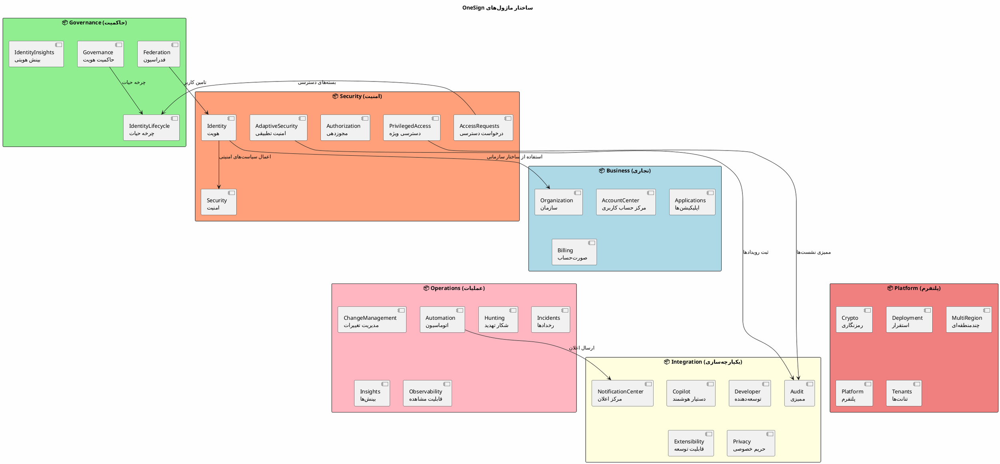
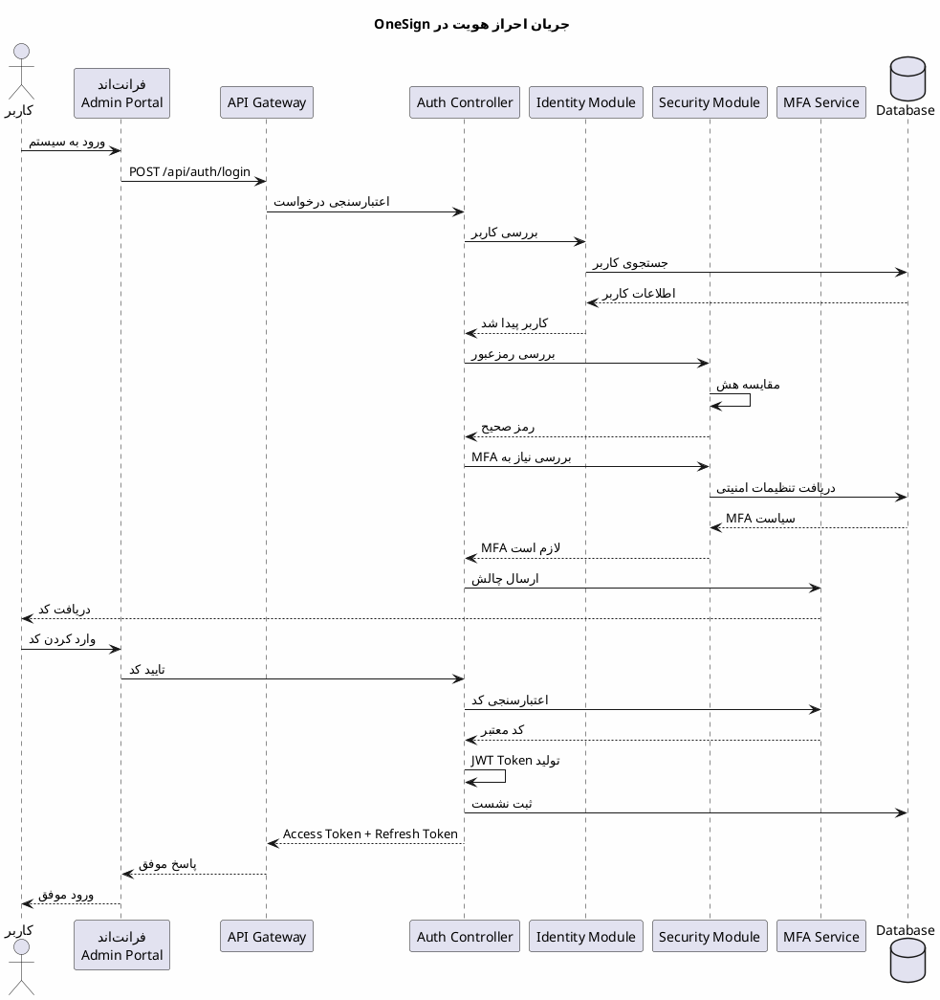
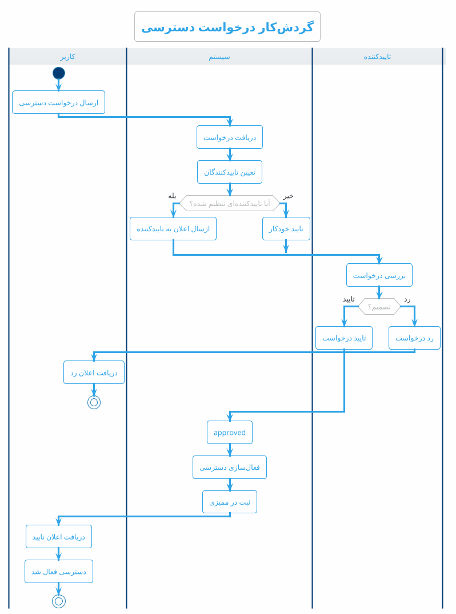
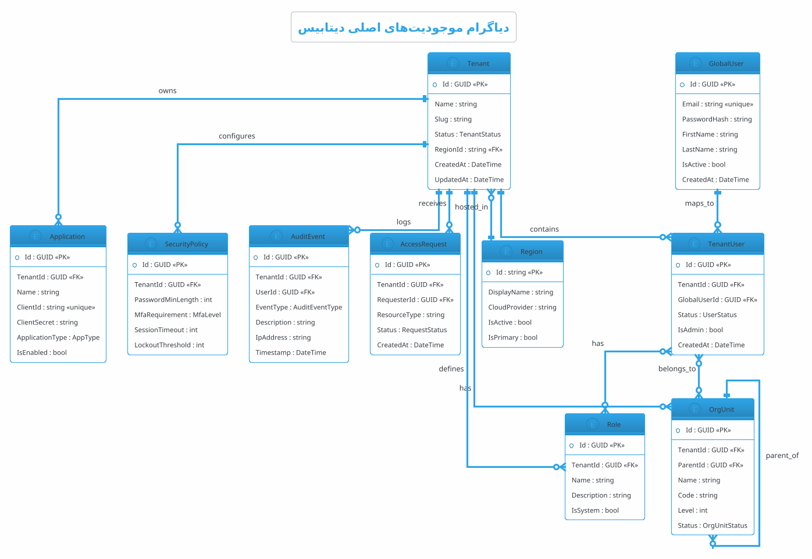
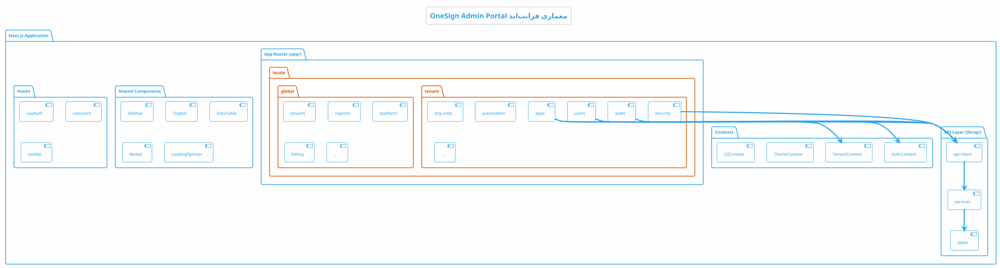

# 📘 سند مشخصات فنی جامع سامانه OneSign

<div dir="rtl">

## فهرست مطالب

- [بخش اول: معرفی کلی](#بخش-اول-معرفی-کلی)
- [بخش دوم: معماری سیستم](#بخش-دوم-معماری-سیستم)
- [بخش سوم: مشخصات API](#بخش-سوم-مشخصات-api)
- [بخش چهارم: نگاشت API به صفحات فرانت‌اند](#بخش-چهارم-نگاشت-api-به-صفحات-فرانت‌اند)
- [بخش پنجم: فیچرها و جزئیات](#بخش-پنجم-فیچرها-و-جزئیات)

---

# بخش اول: معرفی کلی

## ۱.۱ درباره OneSign

**OneSign** یک سامانه جامع مدیریت هویت و دسترسی سازمانی (Enterprise IAM) است که با استفاده از معماری مدرن و استانداردهای صنعتی، امکانات کاملی برای مدیریت چرخه حیات هویت، کنترل دسترسی، امنیت پیشرفته و انطباق با مقررات فراهم می‌کند.

### ویژگی‌های کلیدی

| ویژگی | توضیحات |
|-------|---------|
| **Multi-Tenant** | پشتیبانی از چندین سازمان مستقل با جداسازی کامل داده‌ها |
| **Multi-Region** | توزیع جغرافیایی داده‌ها برای انطباق با Data Residency |
| **Zero Trust** | معماری امنیتی بدون اعتماد با تایید مداوم |
| **Cloud-Native** | طراحی بومی ابری با Container و Kubernetes |
| **API-First** | طراحی کاملاً مبتنی بر API برای یکپارچه‌سازی آسان |

### تکنولوژی‌های استفاده‌شده

| لایه | تکنولوژی |
|------|----------|
| **Backend** | .NET 10, ASP.NET Core, Entity Framework Core |
| **Frontend** | React/Next.js 15, TypeScript, Tailwind CSS |
| **Database** | SQL Server, Redis |
| **Message Queue** | RabbitMQ |
| **Search** | Elasticsearch |
| **Identity Protocols** | OAuth 2.0, OpenID Connect, SAML 2.0, SCIM 2.0 |

---

# بخش دوم: معماری سیستم

## ۲.۱ دیاگرام معماری کلی سیستم

```plantuml
@startuml OneSign_System_Architecture
!theme cerulean-outline
skinparam backgroundColor #FEFEFE
skinparam componentStyle rectangle

title معماری کلی سامانه OneSign

package "کلاینت‌ها (Clients)" {
    [پورتال مدیریت\nAdmin Portal] as AdminPortal
    [اپلیکیشن‌های وب\nWeb Applications] as WebApps
    [اپلیکیشن موبایل\nMobile Apps] as MobileApps
    [سرویس‌های خارجی\nExternal Services] as ExtServices
}

cloud "API Gateway" {
    [Load Balancer] as LB
    [Rate Limiter] as RL
    [Authentication] as Auth
}

package "Backend Services" {
    package "API Layer" {
        [Onesign.Api] as API
    }
    
    package "Business Modules" {
        [AccountCenter] as ACM
        [Applications] as APM
        [Billing] as BLM
        [Organization] as ORM
    }
    
    package "Governance Modules" {
        [Federation] as FDM
        [Governance] as GVM
        [IdentityInsights] as IIM
        [IdentityLifecycle] as ILM
    }
    
    package "Integration Modules" {
        [Audit] as AUM
        [Copilot] as CPM
        [Developer] as DVM
        [Extensibility] as EXM
        [NotificationCenter] as NCM
        [Privacy] as PRM
    }
    
    package "Operations Modules" {
        [Automation] as ATM
        [ChangeManagement] as CMM
        [Hunting] as HTM
        [Incidents] as ICM
        [Insights] as INM
        [Observability] as OBM
    }
    
    package "Platform Modules" {
        [Crypto] as CRM
        [Deployment] as DPM
        [MultiRegion] as MRM
        [Platform] as PLM
        [Tenants] as TNM
    }
    
    package "Security Modules" {
        [AccessRequests] as ARM
        [AdaptiveSecurity] as ASM
        [Authorization] as AZM
        [Identity] as IDM
        [PrivilegedAccess] as PAM
        [Security] as SCM
    }
}

package "Shared Infrastructure" {
    [Onesign.Shared] as Shared
    [Onesign.Data] as Data
}

database "داده‌ها (Data Layer)" {
    [SQL Server] as SQL
    [Redis Cache] as Redis
    [Elasticsearch] as ES
}

queue "Message Bus" {
    [RabbitMQ] as MQ
}

AdminPortal --> LB
WebApps --> LB
MobileApps --> LB
ExtServices --> LB

LB --> RL
RL --> Auth
Auth --> API

API --> ACM
API --> APM
API --> FDM
API --> IDM
API --> SCM
API --> ATM
API --> AUM

ACM --> Shared
APM --> Shared
IDM --> Shared
SCM --> Shared

Shared --> Data
Data --> SQL
Data --> Redis

ATM --> MQ
NCM --> MQ
AUM --> ES

@enduml
```

## ۲.۲ دیاگرام ماژول‌های سیستم



## ۲.۳ دیاگرام جریان احراز هویت



## ۲.۴ دیاگرام جریان درخواست دسترسی



## ۲.۵ دیاگرام ساختار دیتابیس (Entity Relationship)



## ۲.۶ دیاگرام معماری فرانت‌اند



---

# بخش سوم: مشخصات API

## ۳.۱ فهرست کامل API Endpoints

### 🔐 احراز هویت (Authentication)

| متد | مسیر | توضیحات |
|-----|------|---------|
| `POST` | `/api/auth/login` | ورود کاربر با ایمیل و رمزعبور |
| `POST` | `/api/auth/logout` | خروج کاربر و ابطال نشست |
| `POST` | `/api/auth/forgot-password` | درخواست بازنشانی رمزعبور |
| `POST` | `/api/auth/reset-password` | بازنشانی رمزعبور با توکن |
| `POST` | `/api/auth/complete-first-login` | تکمیل اطلاعات ورود اول |
| `POST` | `/api/auth/google-login` | ورود با حساب گوگل |
| `POST` | `/api/token` | دریافت Access Token (OAuth 2.0) |
| `GET` | `/api/authorize` | Authorize Endpoint (OAuth 2.0) |
| `GET` | `/api/userinfo` | اطلاعات کاربر جاری (OIDC) |

### 🔍 Discovery Endpoints

| متد | مسیر | توضیحات |
|-----|------|---------|
| `GET` | `/.well-known/openid-configuration` | متادیتای OpenID Connect |
| `GET` | `/.well-known/jwks.json` | کلیدهای عمومی JWT |

---

### 👥 مدیریت کاربران (User Management)

**پایه:** `/api/tenant/users`

| متد | مسیر | توضیحات | صفحه فرانت‌اند |
|-----|------|---------|---------------|
| `GET` | `/api/tenant/users` | دریافت لیست کاربران | `tenant/users/page.tsx` |
| `GET` | `/api/tenant/users/{id}` | دریافت جزئیات کاربر | `tenant/users/[id]/page.tsx` |
| `POST` | `/api/tenant/users` | ایجاد کاربر جدید | `tenant/users/page.tsx` (Modal) |
| `PUT` | `/api/tenant/users/{id}` | به‌روزرسانی کاربر | `tenant/users/[id]/page.tsx` |
| `DELETE` | `/api/tenant/users/{id}` | حذف کاربر | `tenant/users/page.tsx` |
| `GET` | `/api/tenant/users/current/scope` | محدوده دسترسی کاربر جاری | همه صفحات Tenant |
| `GET` | `/api/tenant/users/{id}/org-units` | واحدهای سازمانی کاربر | `tenant/users/[id]/page.tsx` |
| `PUT` | `/api/tenant/users/{id}/org-units` | تخصیص واحد سازمانی | `tenant/users/[id]/page.tsx` |

---

### 🏢 واحدهای سازمانی (Organization Units)

**پایه:** `/api/tenant/org-units` یا `/api/tenant/orgunits`

| متد | مسیر | توضیحات | صفحه فرانت‌اند |
|-----|------|---------|---------------|
| `GET` | `/api/tenant/orgunits/tree` | دریافت درخت سازمانی | `tenant/org-units/page.tsx` |
| `GET` | `/api/tenant/orgunits/{id}` | دریافت جزئیات واحد | `tenant/org-units/[id]/page.tsx` |
| `POST` | `/api/tenant/orgunits` | ایجاد واحد جدید | `tenant/org-units/page.tsx` |
| `PUT` | `/api/tenant/orgunits/{id}` | به‌روزرسانی واحد | `tenant/org-units/[id]/page.tsx` |
| `DELETE` | `/api/tenant/orgunits/{id}` | حذف واحد | `tenant/org-units/page.tsx` |

---

### 📱 اپلیکیشن‌ها (Applications)

**پایه:** `/api/tenant/applications`

| متد | مسیر | توضیحات | صفحه فرانت‌اند |
|-----|------|---------|---------------|
| `GET` | `/api/tenant/applications` | لیست اپلیکیشن‌ها | `tenant/apps/page.tsx` |
| `GET` | `/api/tenant/applications/{id}` | جزئیات اپلیکیشن | `tenant/apps/[id]/page.tsx` |
| `POST` | `/api/tenant/applications` | ثبت اپلیکیشن جدید | `tenant/apps/page.tsx` |
| `PUT` | `/api/tenant/applications/{id}` | به‌روزرسانی اپلیکیشن | `tenant/apps/[id]/page.tsx` |
| `DELETE` | `/api/tenant/applications/{id}` | حذف اپلیکیشن | `tenant/apps/page.tsx` |
| `POST` | `/api/tenant/applications/{id}/regenerate-secret` | تولید مجدد Secret | `tenant/apps/[id]/page.tsx` |
| `GET` | `/api/tenant/applications/{id}/org-units` | واحدهای سازمانی اپ | `tenant/apps/[id]/page.tsx` |

---

### 🔒 سیاست‌های امنیتی (Security Policies)

**پایه:** `/api/tenant/security`

| متد | مسیر | توضیحات | صفحه فرانت‌اند |
|-----|------|---------|---------------|
| `GET` | `/api/tenant/security/policy` | دریافت سیاست امنیتی | `tenant/security/page.tsx` |
| `PUT` | `/api/tenant/security/policy` | به‌روزرسانی سیاست | `tenant/security/page.tsx` |
| `GET` | `/api/tenant/security/policy/org-unit-rules` | قوانین MFA واحدها | `tenant/security/page.tsx` |
| `POST` | `/api/tenant/security/policy/org-unit-rules` | افزودن قاعده MFA | `tenant/security/page.tsx` |

---

### 🛡️ امنیت تطبیقی (Adaptive Security)

**پایه:** `/api/tenant/adaptive-security` یا `/api/tenant/adaptivesecurity`

| متد | مسیر | توضیحات | صفحه فرانت‌اند |
|-----|------|---------|---------------|
| `GET` | `/api/tenant/adaptivesecurity/policies` | لیست سیاست‌های تطبیقی | `tenant/adaptive-security/page.tsx` |
| `POST` | `/api/tenant/adaptivesecurity/policies` | ایجاد سیاست جدید | `tenant/adaptive-security/page.tsx` |
| `PUT` | `/api/tenant/adaptivesecurity/policies/{id}` | به‌روزرسانی سیاست | `tenant/adaptive-security/page.tsx` |
| `DELETE` | `/api/tenant/adaptivesecurity/policies/{id}` | حذف سیاست | `tenant/adaptive-security/page.tsx` |
| `GET` | `/api/tenant/adaptivesecurity/dashboard` | داشبورد امنیتی | `tenant/adaptive-security/page.tsx` |
| `GET` | `/api/tenant/adaptivesecurity/signals` | سیگنال‌های امنیتی | `tenant/adaptive-security/page.tsx` |
| `POST` | `/api/tenant/adaptivesecurity/signals` | ثبت سیگنال جدید | `tenant/adaptive-security/page.tsx` |
| `GET` | `/api/tenant/adaptivesecurity/high-risk-users` | کاربران پرریسک | `tenant/adaptive-security/page.tsx` |
| `GET` | `/api/tenant/adaptivesecurity/users/{id}/context` | بافت امنیتی کاربر | `tenant/adaptive-security/page.tsx` |
| `PUT` | `/api/tenant/adaptivesecurity/users/{id}/context` | به‌روزرسانی بافت | `tenant/adaptive-security/page.tsx` |

---

### 🎟️ درخواست دسترسی (Access Requests)

**پایه:** `/api/tenant/access-requests` یا `/api/tenant/accessrequests`

| متد | مسیر | توضیحات | صفحه فرانت‌اند |
|-----|------|---------|---------------|
| `GET` | `/api/tenant/accessrequests` | لیست درخواست‌ها | `tenant/access-requests/page.tsx` |
| `POST` | `/api/tenant/accessrequests` | ارسال درخواست جدید | `tenant/access-requests/page.tsx` |
| `GET` | `/api/tenant/accessrequests/{id}` | جزئیات درخواست | `tenant/access-requests/[id]/page.tsx` |
| `POST` | `/api/tenant/accessrequests/{id}/approve` | تایید درخواست | `tenant/access-requests/[id]/page.tsx` |
| `POST` | `/api/tenant/accessrequests/{id}/reject` | رد درخواست | `tenant/access-requests/[id]/page.tsx` |

---

### 🔑 دسترسی ویژه (Privileged Access)

**پایه:** `/api/tenant/privileged-access` یا `/api/tenant/privilegedaccess`

| متد | مسیر | توضیحات | صفحه فرانت‌اند |
|-----|------|---------|---------------|
| `GET` | `/api/tenant/privilegedaccess/dashboard` | داشبورد PAM | `tenant/privileged-access/page.tsx` |
| `GET` | `/api/tenant/privilegedaccess/jit/grants` | لیست JIT grants | `tenant/privileged-access/page.tsx` |
| `POST` | `/api/tenant/privilegedaccess/jit/request` | درخواست JIT | `tenant/privileged-access/page.tsx` |
| `POST` | `/api/tenant/privilegedaccess/jit/grants/{id}/revoke` | لغو JIT | `tenant/privileged-access/page.tsx` |
| `GET` | `/api/tenant/privilegedaccess/breakglass-accounts` | حساب‌های اضطراری | `tenant/privileged-access/page.tsx` |
| `POST` | `/api/tenant/privilegedaccess/breakglass-accounts/{id}/activate` | فعال‌سازی اضطراری | `tenant/privileged-access/page.tsx` |
| `GET` | `/api/tenant/privilegedaccess/sessions` | نشست‌های ویژه | `tenant/privileged-access/page.tsx` |

---

### 🔐 MFA

**پایه:** `/api/tenant/mfa`

| متد | مسیر | توضیحات | صفحه فرانت‌اند |
|-----|------|---------|---------------|
| `GET` | `/api/tenant/mfa/methods` | روش‌های MFA کاربر | `tenant/mfa-management/page.tsx` |
| `POST` | `/api/tenant/mfa/enroll/totp` | ثبت‌نام TOTP | `tenant/mfa-management/page.tsx` |
| `POST` | `/api/tenant/mfa/enroll/sms` | ثبت‌نام SMS | `tenant/mfa-management/page.tsx` |
| `POST` | `/api/tenant/mfa/enroll/email` | ثبت‌نام Email | `tenant/mfa-management/page.tsx` |
| `DELETE` | `/api/tenant/mfa/methods/{id}` | حذف روش MFA | `tenant/mfa-management/page.tsx` |
| `POST` | `/api/tenant/mfa/verify` | تایید کد MFA | `tenant/mfa-management/page.tsx` |
| `POST` | `/api/tenant/mfa/backup-codes` | تولید کدهای پشتیبان | `tenant/mfa-management/page.tsx` |

---

### 📊 ممیزی (Audit)

**پایه:** `/api/tenant/audit`

| متد | مسیر | توضیحات | صفحه فرانت‌اند |
|-----|------|---------|---------------|
| `GET` | `/api/tenant/audit` | لاگ رویدادها | `tenant/audit/page.tsx` |
| `GET` | `/api/tenant/audit/{id}` | جزئیات رویداد | `tenant/audit/page.tsx` |
| `GET` | `/api/tenant/audit/export` | صادرات لاگ | `tenant/audit/page.tsx` |

---

### ⚙️ اتوماسیون (Automation)

**پایه:** `/api/tenant/automation`

| متد | مسیر | توضیحات | صفحه فرانت‌اند |
|-----|------|---------|---------------|
| `GET` | `/api/tenant/automation/workflows` | لیست گردش‌کارها | `tenant/automation/page.tsx` |
| `POST` | `/api/tenant/automation/workflows` | ایجاد گردش‌کار | `tenant/automation/designer/page.tsx` |
| `GET` | `/api/tenant/automation/workflows/{id}` | جزئیات گردش‌کار | `tenant/automation/workflows/[id]/page.tsx` |
| `PUT` | `/api/tenant/automation/workflows/{id}` | به‌روزرسانی | `tenant/automation/workflows/[id]/page.tsx` |
| `DELETE` | `/api/tenant/automation/workflows/{id}` | حذف گردش‌کار | `tenant/automation/page.tsx` |
| `POST` | `/api/tenant/automation/workflows/{id}/execute` | اجرای دستی | `tenant/automation/workflows/[id]/page.tsx` |
| `GET` | `/api/tenant/automation/executions` | لیست اجراها | `tenant/automation/page.tsx` |
| `GET` | `/api/tenant/automation/templates` | الگوها | `tenant/automation/page.tsx` |
| `GET` | `/api/tenant/automation/schedules` | زمان‌بندی‌ها | `tenant/schedules/page.tsx` |

---

### 🔔 اعلان‌ها (Notifications)

**پایه:** `/api/tenant/notifications`

| متد | مسیر | توضیحات | صفحه فرانت‌اند |
|-----|------|---------|---------------|
| `GET` | `/api/tenant/notifications/templates` | الگوهای اعلان | `tenant/notifications/page.tsx` |
| `POST` | `/api/tenant/notifications/templates` | ایجاد الگو | `tenant/notifications/page.tsx` |
| `PUT` | `/api/tenant/notifications/templates/{id}` | به‌روزرسانی الگو | `tenant/notifications/templates/[id]/page.tsx` |
| `DELETE` | `/api/tenant/notifications/templates/{id}` | حذف الگو | `tenant/notifications/page.tsx` |
| `GET` | `/api/tenant/notifications/channels` | کانال‌های ارسال | `tenant/notifications/page.tsx` |
| `POST` | `/api/tenant/notifications/send` | ارسال اعلان | `tenant/notifications/page.tsx` |

---

### 🔄 مدیریت تغییرات (Change Management)

**پایه:** `/api/tenant/change-sets` یا `/api/tenant/changesets`

| متد | مسیر | توضیحات | صفحه فرانت‌اند |
|-----|------|---------|---------------|
| `GET` | `/api/tenant/changesets` | لیست تغییرات | `tenant/change-management/page.tsx` |
| `POST` | `/api/tenant/changesets` | ایجاد تغییر | `tenant/change-management/page.tsx` |
| `GET` | `/api/tenant/changesets/{id}` | جزئیات تغییر | `tenant/change-management/page.tsx` |
| `POST` | `/api/tenant/changesets/{id}/submit` | ارسال برای تایید | `tenant/change-management/page.tsx` |
| `POST` | `/api/tenant/changesets/{id}/approve` | تایید تغییر | `tenant/change-management/page.tsx` |
| `POST` | `/api/tenant/changesets/{id}/reject` | رد تغییر | `tenant/change-management/page.tsx` |
| `POST` | `/api/tenant/changesets/{id}/apply` | اعمال تغییر | `tenant/change-management/page.tsx` |
| `POST` | `/api/tenant/changesets/{id}/rollback` | بازگردانی | `tenant/change-management/page.tsx` |
| `GET` | `/api/tenant/changesets/{id}/simulate` | شبیه‌سازی | `tenant/change-management/page.tsx` |
| `GET` | `/api/tenant/changesets/{id}/impact` | تحلیل تاثیر | `tenant/change-management/page.tsx` |

---

### 🎯 رویدادهای ریسک (Risk Events)

**پایه:** `/api/tenant/risk-events` یا `/api/tenant/riskevents`

| متد | مسیر | توضیحات | صفحه فرانت‌اند |
|-----|------|---------|---------------|
| `GET` | `/api/tenant/riskevents` | لیست رویدادها | `tenant/risk-events/page.tsx` |
| `GET` | `/api/tenant/riskevents/{id}` | جزئیات رویداد | `tenant/risk-events/[id]/page.tsx` |
| `POST` | `/api/tenant/riskevents/{id}/close` | بستن رویداد | `tenant/risk-events/[id]/page.tsx` |

---

### 📱 دستگاه‌های مورد اعتماد (Trusted Devices)

**پایه:** `/api/tenant/trusted-devices` یا `/api/tenant/trusteddevices`

| متد | مسیر | توضیحات | صفحه فرانت‌اند |
|-----|------|---------|---------------|
| `GET` | `/api/tenant/trusteddevices` | لیست دستگاه‌ها | `tenant/sessions/page.tsx` |
| `DELETE` | `/api/tenant/trusteddevices/{id}` | لغو اعتماد | `tenant/sessions/page.tsx` |

---

### 🔑 کلیدهای API (API Keys)

**پایه:** `/api/tenant/api-keys` یا `/api/tenant/apikeys`

| متد | مسیر | توضیحات | صفحه فرانت‌اند |
|-----|------|---------|---------------|
| `GET` | `/api/tenant/apikeys` | لیست کلیدها | `tenant/api-keys/page.tsx` |
| `POST` | `/api/tenant/apikeys` | ایجاد کلید | `tenant/api-keys/page.tsx` |
| `DELETE` | `/api/tenant/apikeys/{id}` | لغو کلید | `tenant/api-keys/page.tsx` |

---

### 🤖 حساب‌های سرویس (Service Accounts)

**پایه:** `/api/tenant/service-accounts` یا `/api/tenant/serviceaccounts`

| متد | مسیر | توضیحات | صفحه فرانت‌اند |
|-----|------|---------|---------------|
| `GET` | `/api/tenant/serviceaccounts` | لیست حساب‌ها | `tenant/service-accounts/page.tsx` |
| `POST` | `/api/tenant/serviceaccounts` | ایجاد حساب | `tenant/service-accounts/page.tsx` |
| `GET` | `/api/tenant/serviceaccounts/{id}` | جزئیات حساب | `tenant/service-accounts/[id]/page.tsx` |
| `PUT` | `/api/tenant/serviceaccounts/{id}` | به‌روزرسانی | `tenant/service-accounts/[id]/page.tsx` |
| `DELETE` | `/api/tenant/serviceaccounts/{id}` | حذف حساب | `tenant/service-accounts/page.tsx` |

---

### 🌍 فدراسیون (Federation)

#### SAML
**پایه:** `/api/tenant/federation/saml`

| متد | مسیر | توضیحات | صفحه فرانت‌اند |
|-----|------|---------|---------------|
| `GET` | `/api/tenant/federation/saml` | لیست SAML Providers | `tenant/federation/page.tsx` |
| `POST` | `/api/tenant/federation/saml` | ایجاد Provider | `tenant/federation/page.tsx` |
| `PUT` | `/api/tenant/federation/saml/{id}` | به‌روزرسانی | `tenant/federation/page.tsx` |
| `DELETE` | `/api/tenant/federation/saml/{id}` | حذف Provider | `tenant/federation/page.tsx` |

#### OIDC
**پایه:** `/api/tenant/federation/oidc`

| متد | مسیر | توضیحات | صفحه فرانت‌اند |
|-----|------|---------|---------------|
| `GET` | `/api/tenant/federation/oidc` | لیست OIDC Providers | `tenant/federation/page.tsx` |
| `POST` | `/api/tenant/federation/oidc` | ایجاد Provider | `tenant/federation/page.tsx` |

#### SCIM
**پایه:** `/api/tenant/federation/scim`

| متد | مسیر | توضیحات | صفحه فرانت‌اند |
|-----|------|---------|---------------|
| `GET` | `/api/tenant/federation/scim/tokens` | لیست توکن‌ها | `tenant/federation/page.tsx` |
| `POST` | `/api/tenant/federation/scim/tokens` | ایجاد توکن | `tenant/federation/page.tsx` |
| `DELETE` | `/api/tenant/federation/scim/tokens/{id}` | لغو توکن | `tenant/federation/page.tsx` |

---

### 📈 بینش‌ها (Insights)

**پایه:** `/api/tenant/insights`

| متد | مسیر | توضیحات | صفحه فرانت‌اند |
|-----|------|---------|---------------|
| `GET` | `/api/tenant/insights/overview` | نمای کلی | `tenant/insights/page.tsx` |
| `GET` | `/api/tenant/insights/apps` | بینش اپلیکیشن‌ها | `tenant/insights/page.tsx` |
| `GET` | `/api/tenant/insights/users/security-posture` | وضعیت امنیتی کاربران | `tenant/insights/page.tsx` |
| `GET` | `/api/tenant/insights/logins` | آمار ورودها | `tenant/insights/page.tsx` |
| `GET` | `/api/tenant/insights/report-subscriptions` | اشتراک گزارش | `tenant/reports/page.tsx` |
| `POST` | `/api/tenant/insights/reports` | تولید گزارش | `tenant/reports/page.tsx` |
| `GET` | `/api/tenant/insights/advanced` | تحلیل پیشرفته | `tenant/insights/advanced/page.tsx` |

---

### 🔍 شکار تهدید (Hunting)

**پایه:** `/api/tenant/hunting`

| متد | مسیر | توضیحات | صفحه فرانت‌اند |
|-----|------|---------|---------------|
| `GET` | `/api/tenant/hunting/saved-queries` | کوئری‌های ذخیره‌شده | `tenant/hunting/page.tsx` |
| `POST` | `/api/tenant/hunting/saved-queries` | ذخیره کوئری | `tenant/hunting/page.tsx` |
| `POST` | `/api/tenant/hunting/execute` | اجرای کوئری | `tenant/hunting/page.tsx` |
| `GET` | `/api/tenant/hunting/scheduled-hunts` | شکارهای زمان‌بندی‌شده | `tenant/hunting/page.tsx` |
| `POST` | `/api/tenant/hunting/scheduled-hunts` | ایجاد شکار زمان‌بندی‌شده | `tenant/hunting/page.tsx` |
| `GET` | `/api/tenant/hunting/runs` | اجراهای شکار | `tenant/hunting/page.tsx` |
| `GET` | `/api/tenant/hunting/datasets` | مجموعه داده‌ها | `tenant/hunting/page.tsx` |

---

### 🚨 رخدادها (Incidents)

**پایه:** `/api/tenant/incidents`

| متد | مسیر | توضیحات | صفحه فرانت‌اند |
|-----|------|---------|---------------|
| `GET` | `/api/tenant/incidents` | لیست رخدادها | `tenant/incidents/page.tsx` |
| `POST` | `/api/tenant/incidents` | ایجاد رخداد | `tenant/incidents/page.tsx` |
| `GET` | `/api/tenant/incidents/{id}` | جزئیات رخداد | `tenant/incidents/[id]/page.tsx` |
| `PUT` | `/api/tenant/incidents/{id}` | به‌روزرسانی | `tenant/incidents/[id]/page.tsx` |
| `POST` | `/api/tenant/incidents/{id}/assign` | تخصیص | `tenant/incidents/[id]/page.tsx` |
| `POST` | `/api/tenant/incidents/{id}/escalate` | تشدید | `tenant/incidents/[id]/page.tsx` |
| `POST` | `/api/tenant/incidents/{id}/resolve` | حل رخداد | `tenant/incidents/[id]/page.tsx` |
| `POST` | `/api/tenant/incidents/{id}/close` | بستن رخداد | `tenant/incidents/[id]/page.tsx` |
| `POST` | `/api/tenant/incidents/{id}/notes` | افزودن یادداشت | `tenant/incidents/[id]/page.tsx` |
| `GET` | `/api/tenant/incidents/statistics` | آمار رخدادها | `tenant/incidents/page.tsx` |
| `GET` | `/api/tenant/incidents/dashboard` | داشبورد | `tenant/incidents/page.tsx` |
| `GET` | `/api/tenant/incidents/sla` | وضعیت SLA | `tenant/incidents/page.tsx` |
| `GET` | `/api/tenant/incidents/categories` | دسته‌بندی‌ها | `tenant/incidents/page.tsx` |

---

### 🔄 چرخه حیات (Lifecycle)

**پایه:** `/api/tenant/lifecycle`

| متد | مسیر | توضیحات | صفحه فرانت‌اند |
|-----|------|---------|---------------|
| `GET` | `/api/tenant/lifecycle/access-packages` | بسته‌های دسترسی | `tenant/lifecycle/page.tsx` |
| `POST` | `/api/tenant/lifecycle/access-packages` | ایجاد بسته | `tenant/lifecycle/page.tsx` |
| `GET` | `/api/tenant/lifecycle/events` | رویدادهای چرخه حیات | `tenant/lifecycle/page.tsx` |
| `GET` | `/api/tenant/lifecycle/policies` | سیاست‌ها | `tenant/lifecycle/page.tsx` |
| `POST` | `/api/tenant/lifecycle/policies` | ایجاد سیاست | `tenant/lifecycle/page.tsx` |
| `GET` | `/api/tenant/lifecycle/hr-records` | رکوردهای HR | `tenant/lifecycle/page.tsx` |

---

### 🔧 قابلیت توسعه (Extensibility)

**پایه:** `/api/tenant/extensibility`

| متد | مسیر | توضیحات | صفحه فرانت‌اند |
|-----|------|---------|---------------|
| `GET` | `/api/tenant/extensibility/webhooks` | لیست Webhook ها | `tenant/extensibility/page.tsx` |
| `POST` | `/api/tenant/extensibility/webhooks` | ایجاد Webhook | `tenant/extensibility/page.tsx` |
| `GET` | `/api/tenant/extensibility/login-hooks` | Login Hooks | `tenant/extensibility/page.tsx` |
| `GET` | `/api/tenant/extensibility/token-rules` | قوانین توکن | `tenant/extensibility/page.tsx` |
| `GET` | `/api/tenant/extensibility/event-types` | انواع رویداد | `tenant/extensibility/page.tsx` |
| `POST` | `/api/tenant/extensibility/actions` | اقدامات سفارشی | `tenant/extensibility/page.tsx` |
| `GET` | `/api/tenant/extensibility/scripts` | اسکریپت‌ها | `tenant/extensibility/page.tsx` |

---

### ⚙️ تنظیمات (Settings)

**پایه:** `/api/tenant/settings`

| متد | مسیر | توضیحات | صفحه فرانت‌اند |
|-----|------|---------|---------------|
| `GET` | `/api/tenant/settings` | تنظیمات تنانت | `tenant/settings/page.tsx` |
| `PUT` | `/api/tenant/settings` | به‌روزرسانی تنظیمات | `tenant/settings/page.tsx` |
| `GET` | `/api/tenant/settings/branding` | تنظیمات برندینگ | `tenant/branding/page.tsx` |
| `PUT` | `/api/tenant/settings/branding` | به‌روزرسانی برندینگ | `tenant/branding/page.tsx` |

---

### 🎯 حاکمیت (Governance)

**پایه:** `/api/tenant/governance`

| متد | مسیر | توضیحات | صفحه فرانت‌اند |
|-----|------|---------|---------------|
| `GET` | `/api/tenant/governance/campaigns` | کمپین‌های بازبینی | `tenant/governance/campaigns/page.tsx` |
| `POST` | `/api/tenant/governance/campaigns` | ایجاد کمپین | `tenant/governance/campaigns/page.tsx` |
| `GET` | `/api/tenant/governance/reviews` | بازبینی‌ها | `tenant/access/reviews/page.tsx` |
| `POST` | `/api/tenant/governance/reviews/{id}/certify` | تایید دسترسی | `tenant/access/certifications/page.tsx` |

---

### 🔐 حریم خصوصی (Privacy)

**پایه:** `/api/tenant/privacy`

| متد | مسیر | توضیحات | صفحه فرانت‌اند |
|-----|------|---------|---------------|
| `GET` | `/api/tenant/privacy/data-requests` | درخواست‌های DSR | `tenant/privacy/page.tsx` |
| `POST` | `/api/tenant/privacy/data-requests` | ارسال درخواست DSR | `tenant/privacy/page.tsx` |
| `POST` | `/api/tenant/privacy/data-requests/{id}/execute` | اجرای DSR | `tenant/privacy/page.tsx` |
| `GET` | `/api/tenant/privacy/retention-policies` | سیاست‌های نگهداری | `tenant/privacy/page.tsx` |
| `PUT` | `/api/tenant/privacy/retention-policies` | به‌روزرسانی سیاست | `tenant/privacy/page.tsx` |

---

### 💰 صورت‌حساب (Billing)

**پایه:** `/api/tenant/billing`

| متد | مسیر | توضیحات | صفحه فرانت‌اند |
|-----|------|---------|---------------|
| `GET` | `/api/tenant/billing/subscription` | اشتراک فعلی | `tenant/billing/page.tsx` |
| `GET` | `/api/tenant/billing/quota-status` | وضعیت سهمیه | `tenant/quotas/page.tsx` |
| `GET` | `/api/tenant/billing/summary` | خلاصه مالی | `tenant/billing/page.tsx` |
| `GET` | `/api/tenant/billing/invoices` | فاکتورها | `tenant/billing/page.tsx` |

---

### 🤖 دستیار هوشمند (Copilot)

**پایه:** `/api/tenant/copilot`

| متد | مسیر | توضیحات | صفحه فرانت‌اند |
|-----|------|---------|---------------|
| `GET` | `/api/tenant/copilot/conversations` | لیست گفتگوها | `tenant/copilot/page.tsx` |
| `POST` | `/api/tenant/copilot/conversations` | شروع گفتگوی جدید | `tenant/copilot/page.tsx` |
| `POST` | `/api/tenant/copilot/messages` | ارسال پیام | `tenant/copilot/page.tsx` |
| `GET` | `/api/tenant/copilot/suggestions` | دریافت پیشنهادات | `tenant/copilot/page.tsx` |

---

### 📊 قابلیت مشاهده (Observability)

**پایه:** `/api/tenant/observability`

| متد | مسیر | توضیحات | صفحه فرانت‌اند |
|-----|------|---------|---------------|
| `GET` | `/api/tenant/observability/metrics` | متریک‌ها | `tenant/observability/page.tsx` |
| `GET` | `/api/tenant/observability/logs` | لاگ‌ها | `tenant/observability/page.tsx` |

---

### 👔 مدیران واگذار شده (Delegated Admins)

**پایه:** `/api/tenant/delegated-admins` یا `/api/tenant/delegatedadmins`

| متد | مسیر | توضیحات | صفحه فرانت‌اند |
|-----|------|---------|---------------|
| `GET` | `/api/tenant/delegatedadmins` | لیست مدیران واگذار شده | `tenant/delegated-admins/page.tsx` |
| `POST` | `/api/tenant/delegatedadmins` | ایجاد مدیر واگذار شده | `tenant/delegated-admins/page.tsx` |
| `GET` | `/api/tenant/delegatedadmins/{id}` | جزئیات مدیر | `tenant/delegated-admins/[id]/page.tsx` |
| `PUT` | `/api/tenant/delegatedadmins/{id}` | به‌روزرسانی | `tenant/delegated-admins/[id]/page.tsx` |
| `DELETE` | `/api/tenant/delegatedadmins/{id}` | حذف مدیر | `tenant/delegated-admins/page.tsx` |

---

## APIهای سطح Global

### 🏢 مدیریت تنانت‌ها (Tenant Management)

**پایه:** `/api/global/tenants`

| متد | مسیر | توضیحات | صفحه فرانت‌اند |
|-----|------|---------|---------------|
| `GET` | `/api/global/tenants` | لیست تنانت‌ها | `global/tenants/page.tsx` |
| `POST` | `/api/global/tenants` | ایجاد تنانت | `global/tenants/page.tsx` |
| `GET` | `/api/global/tenants/{id}` | جزئیات تنانت | `global/tenants/[id]/page.tsx` |
| `PUT` | `/api/global/tenants/{id}` | به‌روزرسانی | `global/tenants/[id]/page.tsx` |
| `POST` | `/api/global/tenants/{id}/suspend` | تعلیق تنانت | `global/tenants/lifecycle/page.tsx` |
| `POST` | `/api/global/tenants/{id}/reactivate` | فعال‌سازی مجدد | `global/tenants/lifecycle/page.tsx` |
| `DELETE` | `/api/global/tenants/{id}` | حذف تنانت | `global/tenants/page.tsx` |

---

### 🌍 مناطق (Regions)

**پایه:** `/api/global/regions`

| متد | مسیر | توضیحات | صفحه فرانت‌اند |
|-----|------|---------|---------------|
| `GET` | `/api/global/regions` | لیست مناطق | `global/regions/page.tsx` |
| `POST` | `/api/global/regions` | ایجاد منطقه | `global/regions/page.tsx` |
| `GET` | `/api/global/regions/{id}` | جزئیات منطقه | `global/regions/page.tsx` |
| `PUT` | `/api/global/regions/{id}` | به‌روزرسانی | `global/regions/page.tsx` |
| `GET` | `/api/global/regions/health` | سلامت مناطق | `global/regions/page.tsx` |
| `GET` | `/api/global/regions/dr-dashboard` | داشبورد DR | `global/regions/page.tsx` |
| `POST` | `/api/global/regions/{id}/failover` | Failover | `global/regions/page.tsx` |
| `POST` | `/api/global/regions/{id}/failback` | Failback | `global/regions/page.tsx` |

---

### 🔐 رمزنگاری (Crypto)

**پایه:** `/api/global/crypto`

| متد | مسیر | توضیحات | صفحه فرانت‌اند |
|-----|------|---------|---------------|
| `GET` | `/api/global/crypto/keysets` | لیست KeySet ها | `global/crypto/page.tsx` |
| `POST` | `/api/global/crypto/keysets` | ایجاد KeySet | `global/crypto/page.tsx` |
| `POST` | `/api/global/crypto/keysets/{id}/rollover` | چرخش کلید | `global/crypto/page.tsx` |
| `GET` | `/api/global/crypto/rotation-policies` | سیاست‌های چرخش | `global/crypto/page.tsx` |
| `PUT` | `/api/global/crypto/rotation-policies` | به‌روزرسانی سیاست | `global/crypto/page.tsx` |

---

### 🖥️ پلتفرم (Platform)

**پایه:** `/api/global/platform`

| متد | مسیر | توضیحات | صفحه فرانت‌اند |
|-----|------|---------|---------------|
| `GET` | `/api/global/platform/version` | نسخه پلتفرم | `global/platform/page.tsx` |
| `GET` | `/api/global/platform/health` | سلامت سیستم | `global/health/page.tsx` |
| `GET` | `/api/global/platform/diagnostics` | تشخیص | `global/diagnostics/page.tsx` |
| `GET` | `/api/global/platform/migrations` | لیست Migrations | `global/migrations/page.tsx` |
| `POST` | `/api/global/platform/migrations/apply` | اعمال Migration | `global/migrations/page.tsx` |
| `GET` | `/api/global/platform/tests/results` | نتایج تست‌ها | `global/platform/page.tsx` |
| `POST` | `/api/global/platform/tests/run` | اجرای تست‌ها | `global/platform/page.tsx` |
| `GET` | `/api/global/platform/api-spec` | مشخصات API | `global/api-management/page.tsx` |
| `POST` | `/api/global/platform/documentation` | تولید مستندات | `global/api-management/page.tsx` |
| `GET` | `/api/global/platform/configuration` | پیکربندی | `global/settings/page.tsx` |

---

### 💰 پلن‌های صورت‌حساب (Billing Plans)

**پایه:** `/api/global/billing`

| متد | مسیر | توضیحات | صفحه فرانت‌اند |
|-----|------|---------|---------------|
| `GET` | `/api/global/billing/plans` | لیست پلن‌ها | `global/billing/page.tsx` |
| `POST` | `/api/global/billing/plans` | ایجاد پلن | `global/billing/page.tsx` |
| `PUT` | `/api/global/billing/plans/{id}` | به‌روزرسانی پلن | `global/billing/page.tsx` |
| `GET` | `/api/global/billing/tenants` | وضعیت مالی تنانت‌ها | `global/billing/page.tsx` |
| `POST` | `/api/global/billing/invoices` | صدور فاکتور | `global/billing/page.tsx` |

---

### 🌐 محیط‌ها (Environments)

**پایه:** `/api/global/environments`

| متد | مسیر | توضیحات | صفحه فرانت‌اند |
|-----|------|---------|---------------|
| `GET` | `/api/global/environments` | لیست محیط‌ها | `global/environments/page.tsx` |
| `POST` | `/api/global/environments` | ایجاد محیط | `global/environments/page.tsx` |
| `POST` | `/api/global/environments/{id}/bootstrap` | راه‌اندازی محیط | `global/environments/page.tsx` |
| `GET` | `/api/global/environments/{id}/configuration` | پیکربندی محیط | `global/environments/page.tsx` |

---

### 📊 بینش‌های سطح پلتفرم (Global Insights)

**پایه:** `/api/global/insights`

| متد | مسیر | توضیحات | صفحه فرانت‌اند |
|-----|------|---------|---------------|
| `GET` | `/api/global/insights/tenants/overview` | نمای کلی تنانت‌ها | `global/insights/page.tsx` |
| `GET` | `/api/global/insights/tenants/risky` | تنانت‌های پرریسک | `global/insights/page.tsx` |
| `GET` | `/api/global/insights/usage` | آمار استفاده | `global/insights/page.tsx` |
| `GET` | `/api/global/insights/growth` | رشد | `global/insights/page.tsx` |
| `GET` | `/api/global/insights/advanced` | تحلیل پیشرفته | `global/insights/advanced/page.tsx` |

---

### 🔍 شکار تهدید سطح پلتفرم (Global Hunting)

**پایه:** `/api/global/hunting`

| متد | مسیر | توضیحات | صفحه فرانت‌اند |
|-----|------|---------|---------------|
| `GET` | `/api/global/hunting/saved-queries` | کوئری‌های ذخیره‌شده | `global/hunting/page.tsx` |
| `POST` | `/api/global/hunting/saved-queries` | ذخیره کوئری | `global/hunting/page.tsx` |
| `POST` | `/api/global/hunting/execute` | اجرای کوئری | `global/hunting/page.tsx` |
| `GET` | `/api/global/hunting/scheduled-hunts` | شکارهای زمان‌بندی‌شده | `global/hunting/page.tsx` |
| `POST` | `/api/global/hunting/scheduled-hunts` | ایجاد شکار زمان‌بندی‌شده | `global/hunting/page.tsx` |
| `GET` | `/api/global/hunting/runs` | اجراها | `global/hunting/page.tsx` |
| `GET` | `/api/global/hunting/cross-tenant` | شکار بین‌تنانتی | `global/hunting/page.tsx` |

---

### ⚙️ اتوماسیون سطح پلتفرم (Global Automation)

**پایه:** `/api/global/automation`

| متد | مسیر | توضیحات | صفحه فرانت‌اند |
|-----|------|---------|---------------|
| `GET` | `/api/global/automation/templates` | الگوها | `global/automation/page.tsx` |
| `POST` | `/api/global/automation/templates` | ایجاد الگو | `global/automation/page.tsx` |
| `GET` | `/api/global/automation/workflows` | گردش‌کارها | `global/automation/page.tsx` |
| `POST` | `/api/global/automation/workflows` | ایجاد گردش‌کار | `global/automation/page.tsx` |
| `GET` | `/api/global/automation/executions` | اجراها | `global/automation/page.tsx` |

---

### 🤖 دستیار هوشمند سطح پلتفرم (Global Copilot)

**پایه:** `/api/global/copilot`

| متد | مسیر | توضیحات | صفحه فرانت‌اند |
|-----|------|---------|---------------|
| `GET` | `/api/global/copilot/conversations` | گفتگوها | `global/copilot/page.tsx` |
| `POST` | `/api/global/copilot/conversations` | شروع گفتگو | `global/copilot/page.tsx` |
| `POST` | `/api/global/copilot/messages` | ارسال پیام | `global/copilot/page.tsx` |
| `GET` | `/api/global/copilot/suggestions` | پیشنهادات | `global/copilot/page.tsx` |
| `GET` | `/api/global/copilot/insights` | بینش‌ها | `global/copilot/page.tsx` |
| `POST` | `/api/global/copilot/automation-drafts` | پیش‌نویس اتوماسیون | `global/copilot/page.tsx` |

---

### 🔄 مدیریت تغییرات سطح پلتفرم (Global Change Sets)

**پایه:** `/api/global/change-sets` یا `/api/global/changesets`

| متد | مسیر | توضیحات | صفحه فرانت‌اند |
|-----|------|---------|---------------|
| `GET` | `/api/global/changesets` | لیست تغییرات | `global/change-management/page.tsx` |
| `POST` | `/api/global/changesets` | ایجاد تغییر | `global/change-management/page.tsx` |
| `GET` | `/api/global/changesets/{id}` | جزئیات | `global/change-management/page.tsx` |
| `POST` | `/api/global/changesets/{id}/submit` | ارسال برای تایید | `global/change-management/page.tsx` |
| `POST` | `/api/global/changesets/{id}/approve` | تایید | `global/change-management/page.tsx` |
| `POST` | `/api/global/changesets/{id}/reject` | رد | `global/change-management/page.tsx` |
| `POST` | `/api/global/changesets/{id}/apply` | اعمال | `global/change-management/page.tsx` |
| `POST` | `/api/global/changesets/{id}/rollback` | بازگردانی | `global/change-management/page.tsx` |
| `GET` | `/api/global/changesets/{id}/simulate` | شبیه‌سازی | `global/change-management/page.tsx` |
| `GET` | `/api/global/changesets/{id}/impact` | تحلیل تاثیر | `global/change-management/page.tsx` |

---

### 📊 قابلیت مشاهده سطح پلتفرم (Global Observability)

**پایه:** `/api/global/observability`

| متد | مسیر | توضیحات | صفحه فرانت‌اند |
|-----|------|---------|---------------|
| `GET` | `/api/global/observability/metrics` | متریک‌ها | `global/observability/page.tsx` |
| `GET` | `/api/global/observability/logs` | لاگ‌ها | `global/observability/page.tsx` |

---

### 🔧 مدیریت کاربران ادمین (Admin Users)

**پایه:** `/api/admin/tenants`

| متد | مسیر | توضیحات | صفحه فرانت‌اند |
|-----|------|---------|---------------|
| `GET` | `/api/admin/tenants` | لیست تنانت‌ها (ادمین) | `admin/tenants/page.tsx` |
| `POST` | `/api/admin/tenants` | ایجاد تنانت (ادمین) | `admin/tenants/page.tsx` |

---

### 🔍 Health Checks

| متد | مسیر | توضیحات |
|-----|------|---------|
| `GET` | `/live` | بررسی زنده بودن سرویس |
| `GET` | `/ready` | بررسی آمادگی سرویس |

---

# بخش چهارم: نگاشت API به صفحات فرانت‌اند

## ۴.۱ جدول نگاشت کامل

| صفحه فرانت‌اند | API Endpoints اصلی |
|----------------|-------------------|
| `tenant/users/page.tsx` | `GET/POST /api/tenant/users` |
| `tenant/users/[id]/page.tsx` | `GET/PUT/DELETE /api/tenant/users/{id}` |
| `tenant/apps/page.tsx` | `GET/POST /api/tenant/applications` |
| `tenant/apps/[id]/page.tsx` | `GET/PUT/DELETE /api/tenant/applications/{id}` |
| `tenant/org-units/page.tsx` | `GET /api/tenant/orgunits/tree`, `POST /api/tenant/orgunits` |
| `tenant/org-units/[id]/page.tsx` | `GET/PUT/DELETE /api/tenant/orgunits/{id}` |
| `tenant/security/page.tsx` | `GET/PUT /api/tenant/security/policy` |
| `tenant/adaptive-security/page.tsx` | `GET/POST /api/tenant/adaptivesecurity/policies` |
| `tenant/privileged-access/page.tsx` | `GET /api/tenant/privilegedaccess/*` |
| `tenant/access-requests/page.tsx` | `GET/POST /api/tenant/accessrequests` |
| `tenant/audit/page.tsx` | `GET /api/tenant/audit` |
| `tenant/automation/page.tsx` | `GET /api/tenant/automation/workflows` |
| `tenant/automation/designer/page.tsx` | `POST /api/tenant/automation/workflows` |
| `tenant/incidents/page.tsx` | `GET/POST /api/tenant/incidents` |
| `tenant/incidents/[id]/page.tsx` | `GET/PUT /api/tenant/incidents/{id}` |
| `tenant/hunting/page.tsx` | `GET /api/tenant/hunting/*` |
| `tenant/insights/page.tsx` | `GET /api/tenant/insights/*` |
| `tenant/notifications/page.tsx` | `GET /api/tenant/notifications/*` |
| `tenant/change-management/page.tsx` | `GET/POST /api/tenant/changesets` |
| `tenant/federation/page.tsx` | `GET /api/tenant/federation/*` |
| `tenant/privacy/page.tsx` | `GET /api/tenant/privacy/*` |
| `tenant/service-accounts/page.tsx` | `GET/POST /api/tenant/serviceaccounts` |
| `tenant/api-keys/page.tsx` | `GET/POST /api/tenant/apikeys` |
| `tenant/extensibility/page.tsx` | `GET /api/tenant/extensibility/*` |
| `tenant/copilot/page.tsx` | `GET/POST /api/tenant/copilot/*` |
| `tenant/billing/page.tsx` | `GET /api/tenant/billing/*` |
| `tenant/settings/page.tsx` | `GET/PUT /api/tenant/settings` |
| `tenant/branding/page.tsx` | `GET/PUT /api/tenant/settings/branding` |
| `global/tenants/page.tsx` | `GET/POST /api/global/tenants` |
| `global/regions/page.tsx` | `GET /api/global/regions/*` |
| `global/platform/page.tsx` | `GET /api/global/platform/*` |
| `global/crypto/page.tsx` | `GET /api/global/crypto/*` |
| `global/billing/page.tsx` | `GET /api/global/billing/*` |
| `global/environments/page.tsx` | `GET /api/global/environments` |
| `global/insights/page.tsx` | `GET /api/global/insights/*` |
| `global/automation/page.tsx` | `GET /api/global/automation/*` |
| `global/copilot/page.tsx` | `GET/POST /api/global/copilot/*` |
| `global/change-management/page.tsx` | `GET/POST /api/global/changesets` |
| `global/hunting/page.tsx` | `GET /api/global/hunting/*` |

---

# بخش پنجم: فیچرها و جزئیات

*این بخش شامل تمام فیچرهای سند اول می‌باشد. برای مشاهده جزئیات کامل فیچرها به فایل `OneSign-Features-Complete.md` مراجعه کنید.*

---

## خلاصه آمار نهایی

| معیار | مقدار |
|-------|-------|
| **تعداد ماژول‌های بک‌اند** | ۳۲ ماژول |
| **تعداد API Endpoints** | ۲۸۲+ endpoint |
| **تعداد صفحات فرانت‌اند** | ۹۰+ صفحه |
| **تعداد Controller ها** | ۴۵+ controller |
| **انواع رویداد ممیزی** | ۵۰+ نوع |
| **روش‌های احراز هویت** | ۱۰+ روش |
| **پروتکل‌های یکپارچه‌سازی** | SAML 2.0, OIDC, SCIM 2.0, OAuth 2.0 |
| **نوع معماری** | Clean Architecture, CQRS, DDD, Event Sourcing |
| **زبان‌های پشتیبانی رابط کاربری** | فارسی، انگلیسی |
| **فریم‌ورک بک‌اند** | .NET 10, ASP.NET Core |
| **فریم‌ورک فرانت‌اند** | Next.js 15, React, TypeScript |
| **دیتابیس اصلی** | SQL Server |
| **Cache** | Redis |
| **جستجو** | Elasticsearch |
| **Message Queue** | RabbitMQ |

---

<div style="text-align: center; margin-top: 50px; color: #666;">
<strong>سند مشخصات فنی جامع OneSign</strong><br>
نسخه ۱.۰ - آذر ۱۴۰۴<br>
<br>
این سند برای استفاده در قراردادها و معرفی فنی پروژه تهیه شده است.
</div>

</div>

