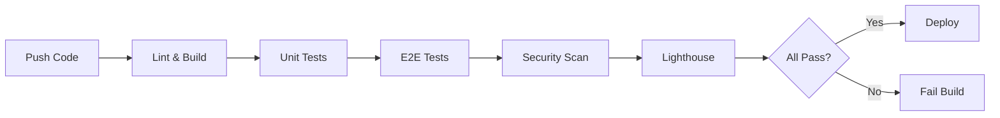

# Architecture Overview

This document provides an overview of the OneSign Landing Page architecture.

## Tech Stack

### Core Framework
- **Next.js 16** - React framework with App Router
- **React 19.2** - UI library
- **TypeScript 5** - Type safety

### Styling
- **Tailwind CSS v4** - Utility-first CSS framework
- Global styles in `app/globals.css`

### Internationalization
- **next-intl 4.5** - i18n solution
- Supported locales: English (en), Farsi (fa)
- RTL support for Farsi

## Project Structure

```
onesign-landing/
├── app/                          # Next.js App Router
│   ├── [locale]/                # Locale-specific routes
│   │   ├── landing/             # Landing page
│   │   ├── layout.tsx           # Locale layout
│   │   └── page.tsx             # Redirect to landing
│   ├── api/                     # API routes
│   │   └── health/              # Health check
│   ├── components/              # React components
│   │   ├── ui/                  # Reusable UI components
│   │   ├── Analytics.tsx        # Analytics wrapper
│   │   └── ErrorBoundary.tsx   # Error handling
│   ├── hooks/                   # Custom React hooks
│   ├── lib/                     # Utility libraries
│   │   ├── analytics.ts         # Analytics utilities
│   │   ├── logger.ts            # Logging utility
│   │   ├── seo.ts               # SEO utilities
│   │   └── utils.ts             # Common utilities
│   ├── __tests__/               # Unit tests
│   ├── globals.css              # Global styles
│   ├── layout.tsx               # Root layout
│   ├── manifest.ts              # PWA manifest
│   ├── robots.ts                # Robots.txt generator
│   └── sitemap.ts               # Sitemap generator
├── e2e/                         # E2E tests (Playwright)
├── messages/                    # i18n translations
│   ├── en.json                  # English
│   └── fa.json                  # Farsi
├── public/                      # Static assets
├── scripts/                     # Utility scripts
│   ├── backup.sh                # Backup script
│   ├── deploy.sh                # Deployment script
│   └── performance-check.sh     # Performance monitoring
├── k8s/                         # Kubernetes manifests
├── nginx/                       # Nginx configuration
├── .github/                     # GitHub Actions workflows
│   └── workflows/
│       ├── ci.yml               # Build & test
│       ├── deploy.yml           # Deployment
│       ├── lighthouse.yml       # Performance
│       ├── security.yml         # Security scans
│       └── test.yml             # Test suite
├── .husky/                      # Git hooks
│   ├── pre-commit               # Pre-commit validation
│   └── commit-msg               # Commit message validation
└── Configuration Files
    ├── package.json             # Dependencies & scripts
    ├── tsconfig.json            # TypeScript config
    ├── next.config.ts           # Next.js config
    ├── i18n.ts                  # i18n config
    ├── proxy.ts                 # Middleware
    ├── jest.config.js           # Jest config
    ├── playwright.config.ts     # Playwright config
    ├── lighthouse-budget.json   # Performance budgets
    ├── ecosystem.config.js      # PM2 config
    ├── docker-compose.yml       # Docker Compose
    ├── Dockerfile               # Production Docker
    └── Dockerfile.dev           # Development Docker
```

## Key Architectural Decisions

### 1. Static Site Generation (SSG)

All pages are statically generated at build time:
- Faster page loads
- Better SEO
- Lower server costs
- CDN-friendly

```typescript
// Automatic static generation
export function generateStaticParams() {
  return locales.map((locale) => ({ locale }));
}
```

### 2. Standalone Output for Docker

Configured for optimized Docker deployments:

```typescript
// next.config.ts
{
  output: 'standalone' as const,
}
```

### 3. Component-Based Architecture

Reusable components in `app/components/ui/`:
- Button, Card, Badge
- Skeleton loaders
- All fully typed with TypeScript

### 4. Custom Hooks

Reusable logic in `app/hooks/`:
- useScrollPosition
- useMediaQuery
- useIsMobile, useIsTablet, useIsDesktop

### 5. Utility Libraries

Common functionality in `app/lib/`:
- **analytics.ts**: Event tracking
- **logger.ts**: Structured logging
- **seo.ts**: SEO utilities
- **utils.ts**: Common helpers

## Data Flow

### 1. Page Request
```
User Request → Middleware → Locale Detection → Page Component
```

### 2. Analytics Flow
```
User Action → Event Tracking → Google Analytics/GTM
```

### 3. Error Handling
```
Error → ErrorBoundary → Logger → User Feedback
```

## Deployment Architecture

### Docker (Recommended)
```
Source Code → Docker Build → Multi-stage Image → Container
```

### Kubernetes
```
Docker Image → K8s Deployment → Service → Ingress → Users
```

### PM2
```
Built App → PM2 Cluster → Load Balanced Processes
```

## Performance Optimizations

### 1. Code Splitting
- Automatic route-based splitting
- Dynamic imports for heavy components

### 2. Image Optimization
- Next.js Image component
- Automatic format conversion (WebP, AVIF)
- Lazy loading

### 3. Caching Strategy
- Static assets: 1 year
- HTML: 1 hour
- API responses: as needed

### 4. Compression
- Gzip enabled in Next.js
- Brotli in Nginx

## Security Measures

### 1. Security Headers
Configured in `next.config.ts`:
- HSTS
- X-Frame-Options
- X-Content-Type-Options
- CSP
- Referrer-Policy

### 2. Docker Security
- Non-root user
- Multi-stage builds
- Minimal base images

### 3. Dependency Security
- Automated audits (npm audit)
- Dependabot updates
- CodeQL analysis

## Monitoring & Observability

### 1. Health Checks
- `/api/health` endpoint
- Uptime monitoring
- Status reporting

### 2. Logging
- Structured JSON logs
- Log levels (DEBUG, INFO, WARN, ERROR)
- Production log aggregation ready

### 3. Analytics
- Page view tracking
- Event tracking
- User behavior analysis

### 4. Performance Monitoring
- Lighthouse CI
- Performance budgets
- Custom performance script

## Testing Strategy

### 1. Unit Tests (Jest)
- Component testing
- Utility function testing
- 70% coverage threshold

### 2. E2E Tests (Playwright)
- Cross-browser testing
- Mobile testing
- Accessibility testing
- Visual regression

### 3. Performance Tests
- Lighthouse CI
- Performance budgets
- Load testing capabilities

### 4. Security Tests
- Dependency audits
- Secret scanning
- Docker image scanning

## CI/CD Pipeline



## Scalability Considerations

### Horizontal Scaling
- Stateless architecture
- Docker containers
- Kubernetes HPA (2-10 replicas)
- Load balancing ready

### Caching
- CDN integration
- Browser caching
- Service worker (optional)

### Performance
- Static generation
- Image optimization
- Code splitting
- Lazy loading

## Future Enhancements

Planned improvements:
- [ ] Blog section
- [ ] Contact form
- [ ] Newsletter subscription
- [ ] Live chat integration
- [ ] A/B testing
- [ ] Dark mode
- [ ] More languages

## Best Practices

### Code Quality
- TypeScript strict mode
- ESLint configuration
- Prettier formatting
- Pre-commit hooks

### Git Workflow
- Conventional commits
- Protected main branch
- PR reviews required
- Automated checks

### Documentation
- Inline code comments
- README files
- Architecture docs
- API documentation

## Resources

- [Next.js Documentation](https://nextjs.org/docs)
- [React Documentation](https://react.dev)
- [Tailwind CSS](https://tailwindcss.com)
- [TypeScript](https://www.typescriptlang.org)
